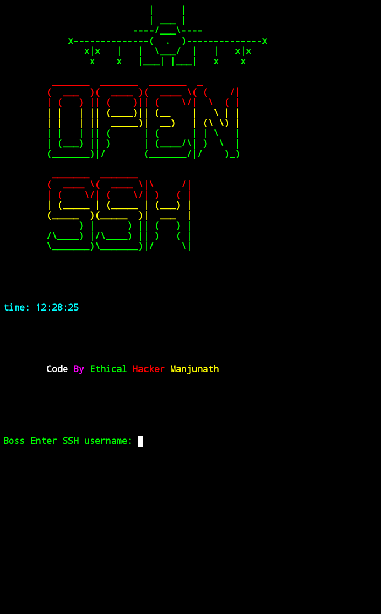

# 🛰 SSH
Hey guys This a bash script tool to connect ssh Easily without any use commands



# This Tool test on 👨‍💻 :

- ubuntu
- Kali
- Termux

🛑 Installation And Requirements 🛑
```bash
apt-get update && apt-get upgrade -y
```
```bash
apt-get install open-ssh -y
```
```bash
apt-get install git -y
```
```bash
git clone https://github.com/Dark-Legends/SSH
```
```bash
cd SSH
```
```bash
chmod +x sshPort.sh
```
```bash
./sshPort.sh
```
